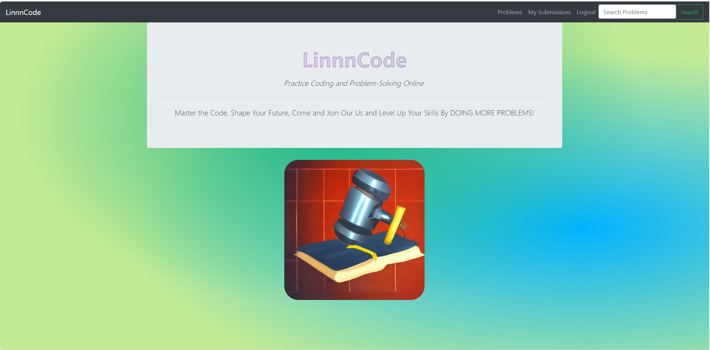
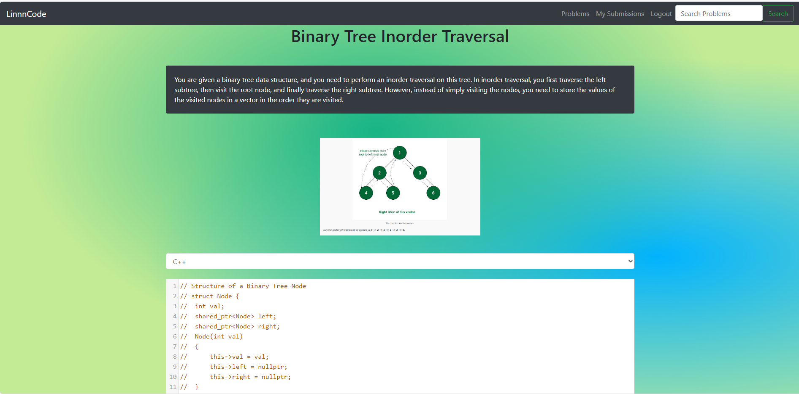
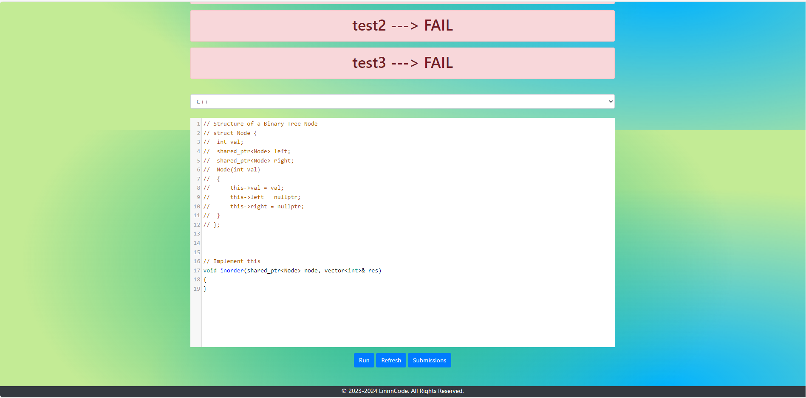
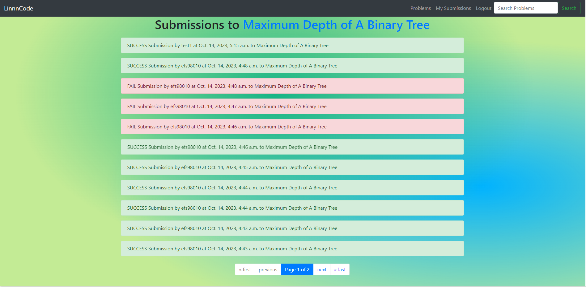
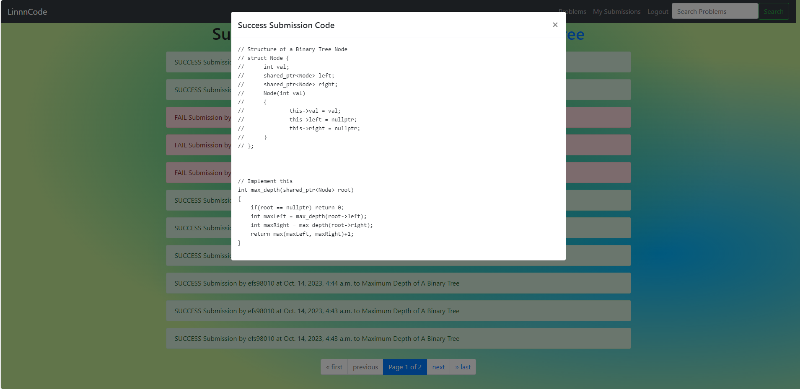

# LinnnCode
Practice Coding and Problem-Solving Online

## Inspiration
During our years as undergrads, we found that often times the courses were too theoretical, and often times lack of practice. We want to build this platform in order to provide a platform for every student who's passionate about practicing coding to do the practice problems online.
## What it does
Our platform is an online coding platform similar to LeetCode/Hackerank, it has a user interface where users can log in, register, view problems, and try out the problems. We embedded a code editor into our platform, and users can submit their code and see the results/feedback in real time! We aim to support 2 languages including Python and C++. Where we implement the judge system from scratch. 
## How we built it
We use HTML, CSS, Bootstrap, and JavaScript for the front end.
And we use Python Django, SQLite, and C++ in the backend.

## Challenges we ran into
Compiling the users' codes on the server without sandboxing is quite dangerous, we used the Python subprocess to solve this problem. Also supporting two or more languages like Python and C++ means we have to write more drivers and find good design patterns to prevent duplicate codes.

## Accomplishments that we're proud of
We successfully implemented the judge system for C++ and the submission viewing functionalities.
We also had a chance to practice building a mini C++ test framework from scratch(for the judge system). It was a challenging but fun experience.

## What we learned
We learned how to implement an online judge system, and how to integrate the frontend submission to our backend judge server. We also had a chance to practice frontend skills by embedding an editor.

## What's next for LinnnCode
We aim to support multiple languages(add more drivers!) and add a to-do list functionality where users can self-assign (potentially assigned by others) the problems they want to solve. We also aim to improve the submission viewing system by adding comment blocks.

## Demo
* Home Page

* Problems

* Problem

* Run The Code

* All Submissions to One Problem

* Viewing Submission Code

* [Presentation Slides](https://github.com/Serenity0204/LinnnCode/blob/master/demo/LinnnCode.pdf)
## General Design Flow:
https://docs.google.com/document/d/151UgRyzX1GIQnWgQZXjd5QYPJwO0W-ZCCpm5zK5xot8/edit?usp=sharing

## System Setup
To run this project run the command 'pip install -r requirements.txt'
